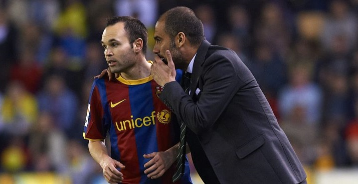

# Iniesta en el F.C. Barcelona

 

### Guardiola (2009): _“Andrés come aparte. No lleva pendientes, no se pinta el pelo, juega 20 minutos y no se queja... Es el ejemplo. Así se lo digo a los chicos: ‘Fijaos en Iniesta’”._

 

Andrés Iniesta tuvo una carrera impresionante en el FC Barcelona, donde jugó desde 2002 hasta 2018. Comenzó su trayectoria en el club tras unirse a La Masia a la edad de 12 años. Hizo su debut con el primer equipo en un partido de la Liga de Campeones contra el Club Brujas en octubre de 2002, bajo la dirección de Louis van Gaal​.

Durante su tiempo en el Barça, Iniesta formó parte de una de las generaciones más exitosas en la historia del fútbol, compartiendo el campo con leyendas como Lionel Messi y Xavi Hernández. Juntos, lograron un total de 32 títulos, incluidos cuatro títulos de la Liga de Campeones, nueve Ligas españolas y tres Copas del Rey​.

Iniesta se destacó no solo por su habilidad técnica y visión de juego, sino también por su capacidad para influir en los momentos cruciales de los partidos.

En 2015, Iniesta fue nombrado capitán del Barcelona, sucediendo a Xavi. Bajo su liderazgo, el equipo continuó ganando trofeos y consolidándose como uno de los mejores de la historia. Su legado en el club se selló con una despedida emotiva en mayo de 2018, tras lo cual se trasladó a jugar al Vissel Kobe en Japón​.

En el plano individual, Iniesta fue reconocido con varios premios, incluyendo el UEFA Best Player Award en 2012 y fue nombrado mejor mediocampista en varias ocasiones. Su talento y dedicación le han valido un lugar entre los mejores mediocampistas de la historia del fútbol​. Nunca ha sido expulsado de un partido.

 

| F.C. Barcelona |      Partidos     | Goles | Asistencias | 
|:---------------|:------------------|:------|:------------|
| 16 Temporadas  |        674        |  57   |     139     |

