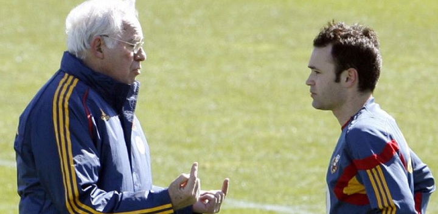

# Iniesta en la Selección Española de Futbol

 

### Luis Aragonés (2007): _"Le he dicho a Iniesta antes de salir que los grandes futbolistas no sólo juegan bien, sino que hacen goles también"._

 

Andrés Iniesta tuvo una destacada carrera con la selección española, donde jugó desde 2006 hasta 2018. Durante este período, se convirtió en un pilar fundamental del equipo y uno de los mejores mediocampistas de la historia del fútbol. Iniesta debutó en la selección absoluta en una amistoso contra Suecia, y rápidamente se ganó un lugar en el equipo titular​.

Su mayor logro con la selección fue ser parte del equipo que ganó la Eurocopa en 2008 y 2012, así como la Copa del Mundo en 2010. En la final del Mundial de Sudáfrica, Iniesta anotó el gol decisivo en la prórroga, otorgándole a España su primer título mundial​.

Por su actuación en el torneo, fue nombrado el mejor jugador de la final, consolidando su estatus como uno de los grandes del fútbol.

Iniesta también tuvo un papel clave en la Euro 2012, donde fue elegido el mejor jugador del torneo, contribuyendo significativamente a la victoria de España sobre Italia en la final​.

A lo largo de su carrera internacional, Iniesta acumuló 130 partidos y 13 goles, siendo así en el jugador español más laureado de la historia​.

Su estilo de juego, caracterizado por su visión, técnica y capacidad para crear oportunidades, lo convirtió en un referente no solo para su selección, sino también para el fútbol mundial. Tras su retiro de la selección en 2018, Iniesta dejó un legado imborrable en la historia del fútbol español​.

 

| Selección Abs. |      Partidos     | Goles | Asistencias | 
|:---------------|:------------------|:------|:------------|
|    12 años     |        131        |  23   |     32      |
